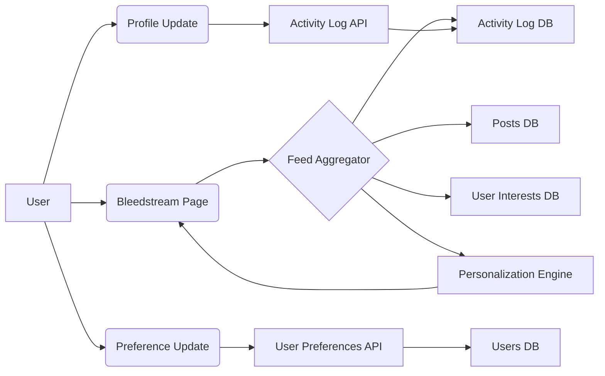

# Bleedstream Architecture Design

## 1. Database Schema Changes:

*   **activity_log table:**
    *   `id` INTEGER PRIMARY KEY AUTOINCREMENT
    *   `user_id` INTEGER NOT NULL
    *   `activity_type` TEXT NOT NULL (e.g., 'new_post', 'profile_update')
    *   `activity_data` TEXT (JSON string containing activity-specific data)
    *   `created_at` TIMESTAMP DEFAULT CURRENT_TIMESTAMP
    *   FOREIGN KEY (`user_id`) REFERENCES `users`(`id`) ON DELETE CASCADE
*   **user_interests table:**
    *   `user_id` INTEGER NOT NULL
    *   `tag` TEXT
    *   `district_id` INTEGER
    *   `glyph_id` INTEGER
    *   FOREIGN KEY (`user_id`) REFERENCES `users`(`id`) ON DELETE CASCADE
    *   FOREIGN KEY (`district_id`) REFERENCES `districts`(`id`) ON DELETE SET NULL
    *   FOREIGN KEY (`glyph_id`) REFERENCES `glyphs`(`id`) ON DELETE SET NULL
*   **users table:**
    *   Add `theme` TEXT DEFAULT 'default'
    *   Add `background_image` TEXT
    *   Add `font_size` TEXT DEFAULT 'medium'
    *   Add `font_color` TEXT DEFAULT 'black'

## 2. API Endpoints:

*   `GET /feed/stream`: Fetches the Bleedstream data, applying personalization.
    *   Parameters: `limit`, `offset`
*   `POST /activity/log`: Logs user activity.
    *   Body: `user_id`, `activity_type`, `activity_data`
*   `POST /user/interests`: Updates user interests.
    *   Body: `tags` (array of strings), `district_id`, `glyph_id`
*   `GET /user/preferences`: Retrieves user preferences.
*   `POST /user/preferences`: Updates user preferences (theme, background image, font size, font color).

## 3. Key Components and Interactions:

*   **Feed Aggregator:** Responsible for fetching data from various sources (activity log, posts) and combining them into a unified feed.
*   **Activity Log API:** Handles logging user activities (new posts, profile updates).
*   **User Preferences API:** Manages user preferences (theme, background image, font size, font color).
*   **Personalization Engine:** Applies personalization logic based on user interests (tags, districts, glyphs).
*   **Real-time Update Server:** Pushes real-time updates to connected clients (using WebSockets).

## 4. Real-time Update Mechanism:

*   **WebSockets:** Use WebSockets for real-time updates.
    *   The server maintains a list of connected clients.
    *   When a new activity is logged, the server pushes the activity data to all connected clients.
    *   Clients update their Bleedstream display upon receiving new data.

## 5. Personalization Algorithm:

*   Fetch user interests (tags, districts, glyphs) from the `user_interests` table.
*   Fetch recent activities and posts.
*   Filter activities and posts based on user interests:
    *   Prioritize activities and posts that match the user's tags, district, or glyphs.
    *   Apply a scoring mechanism to rank activities and posts based on the degree of matching.
*   Display the personalized feed to the user.